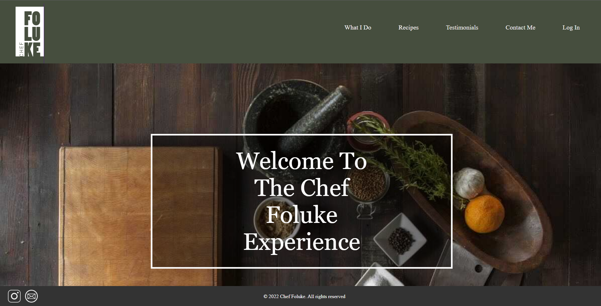

# Personal-Chef

## description

Small business are always looking for a way to get the word out and there and help their customers reach out to them. For this project we decided to help
out a personal chef who was in need of a functionally webiste. Previously chef Foluke had a webiste built but was not fully functioning. So we decided to 
help fill in that gap. 
Foluke needed a website that represented her brand and what she does. To accomplish that we include serveral pages displaying her story, some of her recipes, and testimonials 
of previous clients. This helped get the word out, but how do we help customers get into contact with her? For that we included all of her social media links in the footer and 
a contact form that sends a email to her on submit.

## Table of Contents

* [Installation](#installation)
* [Usage](#usage)

## Installation
Since this is a fully deployed application nothing more is needed than the heroku link to access the website. If you wish to pull down the repo and run it locally
you first will have to run npm install in the client, server, and root directory to make sure you have all the dependancies. After this you can navigate to the root
of the file and use npm run develop which will start up the server as well as the client.

## Usage

The end goal of this application was to display Folukes body of work and help customers reach out to her. With this we create a fully functional and reactive navigation bar 
which takes you through folukes story. 
Our end goal for this application is to have user Login using our login section and leave new testimonials that update in real-time with the username and date.

Image of the deployed app 

link to deployed app 
